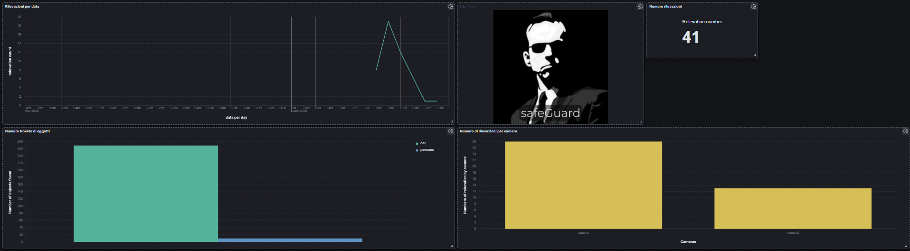

  

# safeGuard
safeGuard is a surveillance solution designed to detect movements within a specified area using cameras. Using image processing techniques, safeGuard not only identifies motion but also tracks and compiles statistics on objects present in the monitored scenes. This enables enhanced security monitoring, providing detailed insights and data-driven analysis for improved safety and situational awareness.

# How it works?

### Data Source 
  - [OrangePI](http://www.orangepi.org/html/hardWare/computerAndMicrocontrollers/details/orange-pi-3-LTS.html) ---> The source data for our project is an Orange Pi device, utilized for motion detection and image capture.
 cryptocurrencies
  
  
### Tools
- **FluentBit**: A lightweight and extensible log processor and forwarder, used for collecting and forwarding log data from various sources.
- **Kafka**: A distributed messaging system employed to facilitate data streaming between different components of the project.
- **Zookeeper**: It helps in maintaining configuration information, naming, providing distributed synchronization, and group services.
- **Spark**: A Python library for distributed data processing, used to perform image detection and object counting.
- **Elasticsearch**: A distributed search and analytics engine, used for storing and indexing data about images.

### Ports
  | Service   | Port      |
  |-----------|-----------|
  | fluentBit | 9090      |
  | kafka     | 9092      |
  | flask     | 9393      |
  | elastic   | 9200      |
  | kibana    | 5601      |

 
 ### Dashboard
 The dashboard displays information related to all the detections present.
 
 

  

### How to start!!

Use `Docker-compose up -d` command  in the shell after cloning repo.Inside the "camera" directory, there will be a script file. This script is intended to be transferred or copied onto a device that has a webcam attached. Once the Docker Compose setup is complete and the containers are running, you will need to execute or activate this script on that device.
